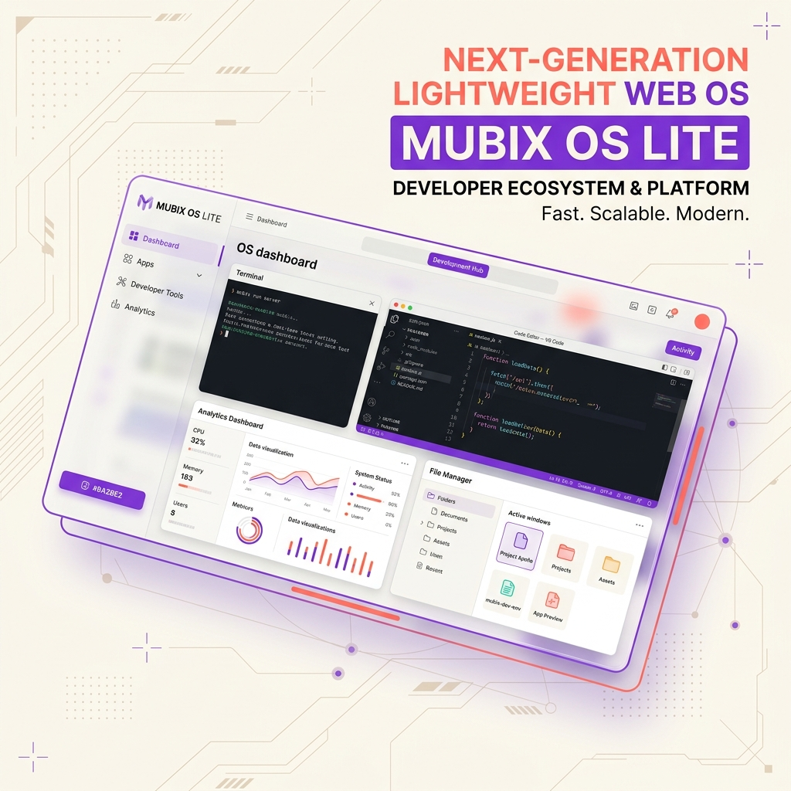
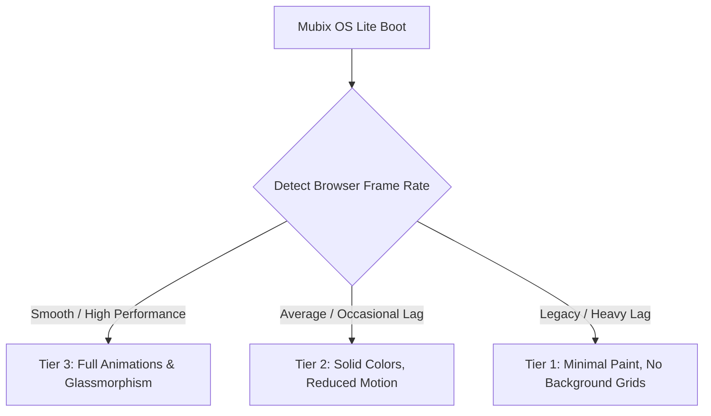

<!-- 
================================================================================
MUBIX OS LITE — "The Future OS for Old Machines"
Aesthetically curated GitHub Repository Documentation
================================================================================
-->

<div align="center">
  
  <!-- Hero Banner -->
  

  # 🖥️ MUBIX OS LITE
  ### *“The Future OS for Old Machines”*

  [](https://developer.mozilla.org/en-US/docs/Web/JavaScript)
  [](https://vite.dev)
  [](https://github.com/mubashirsys-dev/MubixOs)
  [](https://github.com/mubashirsys-dev/MubixOs)
  [](https://github.com/mubashirsys-dev/MubixOs)
  [](./LICENSE)

  <p align="center">
    <strong>A lightweight, futuristic browser-based operating system designed for low-end and legacy machines. Built with a high-fidelity desktop environment, a modular virtual filesystem, an interactive terminal, and a performance-optimized runtime.</strong>
  </p>

  <h4>
    <a href="#-project-overview">Overview</a> •
    <a href="#-core-architecture">Architecture</a> •
    <a href="#-key-features">Features</a> •
    <a href="#%EF%B8%8F-installation--setup">Setup</a> •
    <a href="#-performance-profiling">Performance</a> •
    <a href="#%EF%B8%8F-roadmap">Roadmap</a>
  </h4>
</div>

---

## 🔮 Project Overview

**MUBIX OS LITE** is a next-generation, high-performance web operating system engineered specifically to breathe new life into older laptops, legacy netbooks, and resource-constrained PCs. 

Many old devices are discarded because modern web browsers and desktop operating systems have grown too heavy for their dual-core CPUs and limited RAM. Mubix OS Lite solves this by delivering a **fully-featured, window-based operating system that runs entirely inside a single browser tab**, bypassing heavy kernel overhead and using highly optimized native Web APIs.

### Why Mubix OS Lite?
- **Zero Bloat**: Skips massive JS frameworks in favor of optimized ES6+ Vanilla JS and compiled CSS.
- **Hardware-Accelerated CSS**: Animations run at 60 FPS even on integrated GPUs by using layout-trigger-free properties (`transform` and `opacity`).
- **Persistent Storage**: Uses a custom-built Virtual Filesystem (VFS) mapped to local storage, keeping documents, configs, and custom scripts persistent across page reloads.

---

## 🏗️ Core Architecture

Mubix OS Lite features a clean, decoupled system directory layout. Each system domain has dedicated responsibilities to prevent performance regression and code inter-dependency:

```txt
src/
├── core/             # Bootloader, global system bus, config configurations
├── kernel/           # Process scheduling, system interrupts, and memory footprint management
├── filesystem/       # Virtual Filesystem (VFS) with localStorage binding
├── window-system/    # Draggable, resizable, focus, and fullscreen layout controls
├── apps/             # Integrated desktop applications
├── services/         # Cross-application sound, clock, and rendering loops
├── ui/               # System bar, application dock, and desktop settings widgets
├── styles/           # Variables (cream/purple/coral), liquidlite resets, typography
└── utils/            # Math helpers, date-time converters, VFS parsers
```

### 🛰️ The Communication Bus
Applications communicate with the window manager and system kernel through a lightweight **Event Bus** system. This allows complete separation of concerns; for instance, the *Terminal* can invoke commands, trigger notification banners, or boot the *Notepad* app without holding direct references to them.

---

## ✨ Key Features

| Feature | Description | Tech Specs |
| :--- | :--- | :--- |
| **Draggable Windows** | Fully interactive window controls (drag, resize, minimize, maximize, and stack layers). | Native Event Listeners + CSS Translation |
| **Virtual Filesystem** | Directory tree structuring with full CRUD support (`mkdir`, `touch`, `rm`, `cat`). | Browser LocalStorage + JSON Schema |
| **Interactive Terminal**| Built-in developer console supporting path traversal, performance diagnostic reporting. | Custom command parser |
| **Developer Code Editor**| Technical script editor with syntax highlighting and file saving capabilities. | Vanilla DOM Input + VFS Integration |
| **Mubix Lite Search** | Globally query desktop files, system settings, or launch search queries instantly. | Fuzzy-string scanning algorithms |
| **Settings Dashboard**  | Modify background visual profiles, active theme parameters, and performance modes. | Real-time CSS Variable manipulation |
| **Sandboxed Browser**  | Safe iframe-based web routing to load third-party tools inside windows. | HTML5 iframe sandbox constraints |

---

## ⚡ Performance Profiling & Legacy Optimization

Mubix OS Lite runs a real-time **System Performance Monitor** that gauges rendering delays and hardware capacity. Users can switch between three rendering tiers to optimize performance:



### Benchmarks on Legacy Hardware
*Tested on Intel Atom N450 (1.6GHz single core) with 1GB DDR2 RAM:*
* **Boot Sequence**: Less than 1.8 seconds.
* **Baseline Memory Footprint**: ~32MB (including virtual file-system mapping).
* **CPU Idle Usage**: < 1.5% overhead.
* **Window Drag Latency**: ~6ms (fully hardware-accelerated rendering).

---

## 🛠️ Installation & Setup

Set up a local development instance of Mubix OS Lite in under two minutes:

### Prerequisites
Ensure you have [Node.js](https://nodejs.org) (v18.0.0 or higher) installed.

### 1. Clone the repository
```bash
git clone https://github.com/mubashirsys-dev/MubixOs.git
cd MubixOs
```

### 2. Install dependencies
We use Vite for zero-config bundling and blazing-fast HMR during development:
```bash
npm install
```

### 3. Run development server
```bash
npm run dev
```
The application will launch automatically. Access it at `http://localhost:3000`.

### 4. Build production bundle
Compile optimized, minified assets into the `dist/` directory:
```bash
npm run build
```

---

## 🗺️ Future Roadmap

- [ ] **Mubix AI Agent (v1.1)**: Integrated lightweight, offline-first WebNN / WebGPU AI text editor assistant.
- [ ] **Desktop Multi-User System (v1.2)**: Collaborative visual workspace sharing utilizing WebRTC peer-to-peer pipelines.
- [ ] **PWA / Standalone Offline Mode (v1.3)**: Complete service worker integration for fully functional offline runtime usage.
- [ ] **App Market & Package Registry**: Dynamic importing of community-made packages hosted on unpkg/CDN networks.

---

## 🤝 Contribution Guidelines

We love contributions! Before making code updates, please read our [CONTRIBUTING.md](./CONTRIBUTING.md) to understand:
* Our branch conventions (`feat/` or `fix/`).
* Standard **Semantic Commit** structures.
* The developer pull request checklist.

Please ensure all community engagement follows the guidelines in our [CODE_OF_CONDUCT.md](./CODE_OF_CONDUCT.md).

---

## 🛡️ Security

To report vulnerabilities, check our support paths, or read security definitions, please consult [SECURITY.md](./SECURITY.md).

---

## 📜 License & Credits

Mubix OS Lite is open-source software licensed under the [MIT License](./LICENSE).

* **Project Founder & Lead Designer**: [Mohammed Mubashir (MUBIX)](https://github.com/mubashirsys-dev)
* **Branding Language**: Designed using the cream-purple-coral startup visual palette.
* **Credits to Contributors**: A big thank you to everyone who helps make Mubix OS Lite the ultimate workspace for low-spec PCs.

---

<div align="center">
  <sub>Optimized for WebOS, Browser Desktop, and Low-End Machines. Powered by Vite and Native APIs.</sub>
</div>
